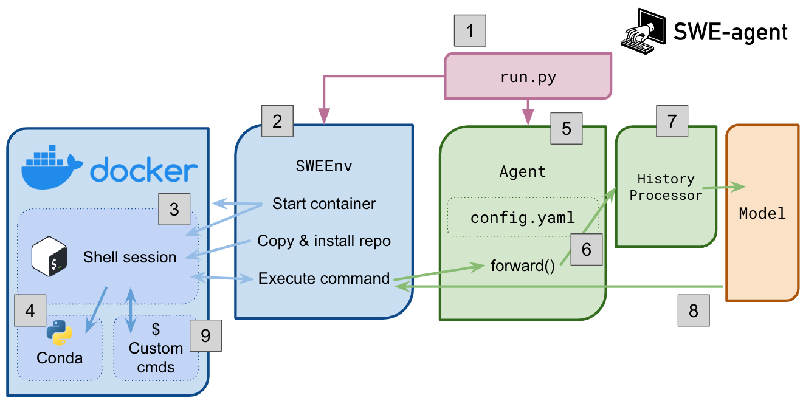

# Architecture

This page walks you through the general architecture of the SWE-agent package. Want to just run it? Jump ahead to the [installation](../installation/index.md) or [usage](../usage/index.md) sections.

The central entry point to SWE-agent is the `run.py` script (1). It initializes the [`SWEEnv`](../reference/env.md) instance (2) that manages the environment. Upon initialization (and by default for every new instance), it starts a docker container together with a shell session (3). This shell session will be kept alive throughout the task. All installation commands and actions from the model will be executed therein.

`SWEEnv` then installs the dependencies of the repository to which the task instance belongs into a new conda environment (4).

The second class that is initialized by `run.py` is the [`Agent`](../reference/agent.md) class (5). It can be configured with a yaml file (see [config](../config/config.md)). It's most important method is `forward()` which prompts the model and executes its action.

To prompt the model, the history (all prompts to the model together with actions and outputs) need to be sent to the LM. In order to make the best use of the context window of the model, the history gets compressed by a `HistoryFormatter` (7). The model output (8) is then interpreted by the `Agent` class and executed in the Shell session via `SWEEnv`.

The [ACI](aci.md) elements are implemented as [custom commands](../config/commands.md) (9) that are available to the shell session.